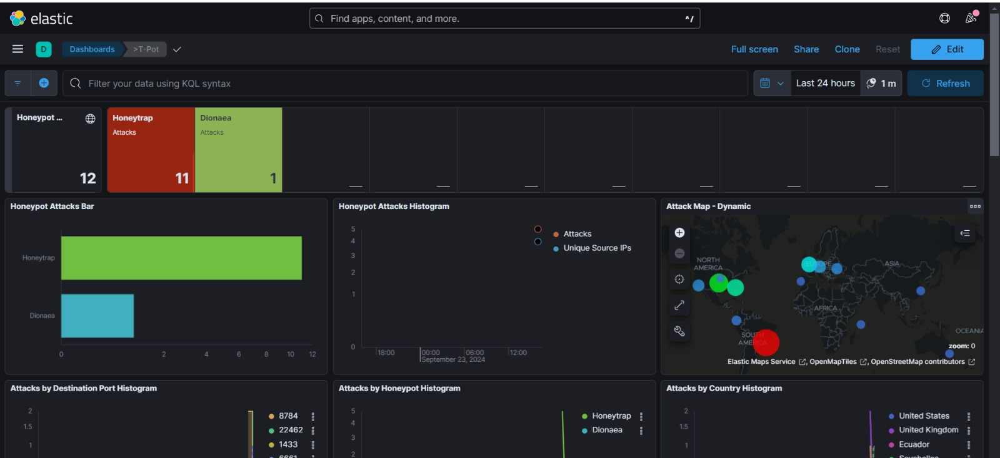

# AWS Honeypot Deployment Using T-Pot

This guide will walk you through deploying a Honeypot on AWS using **T-Pot**. T-Pot is a comprehensive honeypot platform that includes multiple honeypot daemons and a SIEM for analyzing attack data.

## Prerequisites

Before you begin, ensure you meet the following prerequisites:

1. **Operating System**: Use a **Debian support image**. The recommended image is:
    - **Debian 11** | Support by [SupportedImages](https://aws.amazon.com/marketplace/pp/prodview-fgkgvwvmljj5i) (sold by Supported Images).
   
2. **AWS Instance Type**: 
    - It is highly recommended to use a **t3.xlarge** instance on AWS.
        - **Resources**: 16GB of RAM and 160GB of storage.
        - T-Pot includes resource-heavy services like ELK (Elasticsearch, Logstash, Kibana), SIEM, and multiple honeypot daemons, so these specifications help ensure optimal performance.
        - You may experiment with lesser resources, but this configuration is advised for smooth operation and accurate results.
     
3. **Let`s start the process by launching an EC2 instance on AWS! Follow along the configurations:**


---

## Step 1: Update and Install Git

Before starting, make sure your system is up-to-date and Git is installed.

1. Run the following command to update and install Git:

    ```bash
    sudo apt update -y && sudo apt install git -y
    ```

## Step 2: Clone the T-Pot Repository

1. Clone the official T-Pot repository from GitHub:

    ```bash
    git clone https://github.com/telekom-security/tpotce
    ```
    


2. Navigate to the cloned repository:

    ```bash
    cd tpotce
    ```

## Step 3: Run the Installation Script

1. Execute the installation script to begin setting up T-Pot:

    ```bash
    sudo ./install.sh
    ```


2. During installation, select the **HIVE/STANDARD** option when prompted. 


3. Set the username and password for accessing the T-Pot management interface. For example:

    - **Username**: `yousernamehere`
    - **Password**: `CoolP44ssW0rD#`

4. Once the installation is complete, reboot the system:

    ```bash
    sudo reboot
    ```

## Step 4: Update AWS Security Group Rules

After the installation, you'll need to adjust the security group rules in AWS to allow access to necessary ports. This step is crucial for managing T-Pot and capturing attack data.

1. Remove all existing rules in your AWS security group.

2. Add the following four rules to open specific ports. These ports should only be accessible to you (your IP address) to manage T-Pot:

    - **Port 64294 (TCP)**: T-Pot Management – Sensor data transmission to hive (via NGINX reverse proxy) to 127.0.0.1:64305
    - **Port 64295 (TCP)**: T-Pot Management – Access to SSH
    - **Port 64297 (TCP)**: T-Pot Management – Access to NGINX reverse proxy

3. Add the following rule to allow attack traffic from any IP address. This will enable the honeypot to capture malicious traffic:

    - **Custom TCP 0-64000**: Accessible to anyone, to allow attacks to start.
  
   

## Step 5: Access the T-Pot Management Interface

1. To access the T-Pot management interface, open your browser and navigate to the following URL (replace with your instance's public IP):

    ```
    https://<your-aws-instance-public-ip>:64297/
    ```

2. Login using the username and password you set during the installation:

    - **Username**: `youruser`
    - **Password**: `*******************`

## Step 6: Review Your Deployed Honeypot

Congratulations! Your honeypot is now deployed and active. It is set up to capture and analyze various types of attacks. Additionally, it includes a **SIEM** for monitoring and analyzing attack data.




## Additional Notes

- Make sure to monitor the honeypot regularly and adjust security group rules as necessary.
- Always ensure that the T-Pot management ports are secured and only accessible to your IP.
- T-Pot will automatically capture and log attack data, providing valuable insights into network vulnerabilities.

---

For more information and advanced configuration options, visit the [T-Pot GitHub repository](https://github.com/telekom-security/tpotce).
